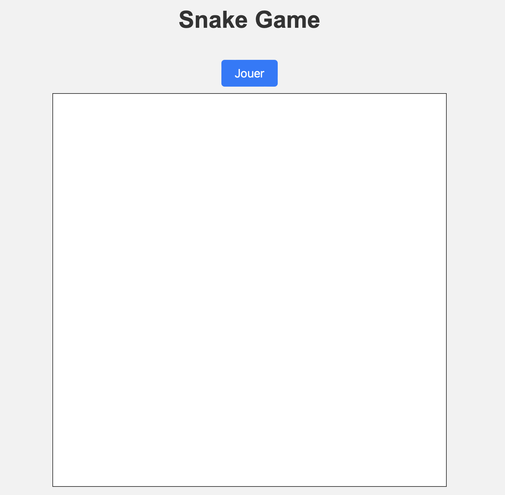

# Jeu du Serpent (Snake) en JavaScript

Un jeu classique du Serpent (Snake) construit en utilisant JavaScript, HTML et CSS. Dans ce jeu, les joueurs contrôlent un serpent qui se déplace sur un terrain de jeu pour manger de la nourriture et grandir. Le but est de survivre aussi longtemps que possible sans entrer en collision avec les bords du terrain ou avec le corps du serpent lui-même.

## Fonctionnalités

- Contrôlez le serpent en utilisant les touches directionnelles du clavier.
- Mangez de la nourriture pour faire grandir le serpent et augmenter votre score.
- Évitez les collisions avec les bords du terrain et avec le corps du serpent.
- Affichage du score en fin de partie.
- Possibilité de redémarrer la partie en cas de défaite.

## Captures d'écran

## Comment jouer

1. Ouvrez le fichier `index.html` dans votre navigateur web.
2. Cliquez sur le bouton "Jouer" pour démarrer la partie.
3. Utilisez les touches directionnelles (Haut, Bas, Gauche, Droite) pour contrôler le serpent.
4. Mangez la nourriture pour augmenter votre score.
5. Évitez les collisions avec les bords du terrain et avec le corps du serpent.
6. Continuez à jouer et essayez d'obtenir le meilleur score possible.

## Personnalisation

Vous pouvez personnaliser ce jeu en modifiant le code JavaScript pour ajuster la vitesse du serpent, la taille du terrain de jeu, les couleurs, etc. Vous pouvez également ajouter des fonctionnalités supplémentaires comme des bonus, des obstacles, ou un système de niveaux.

## Contribution

Les contributions sont les bienvenues ! Si vous souhaitez améliorer ce jeu ou ajouter de nouvelles fonctionnalités, n'hésitez pas à soumettre une demande de tirage (pull request).